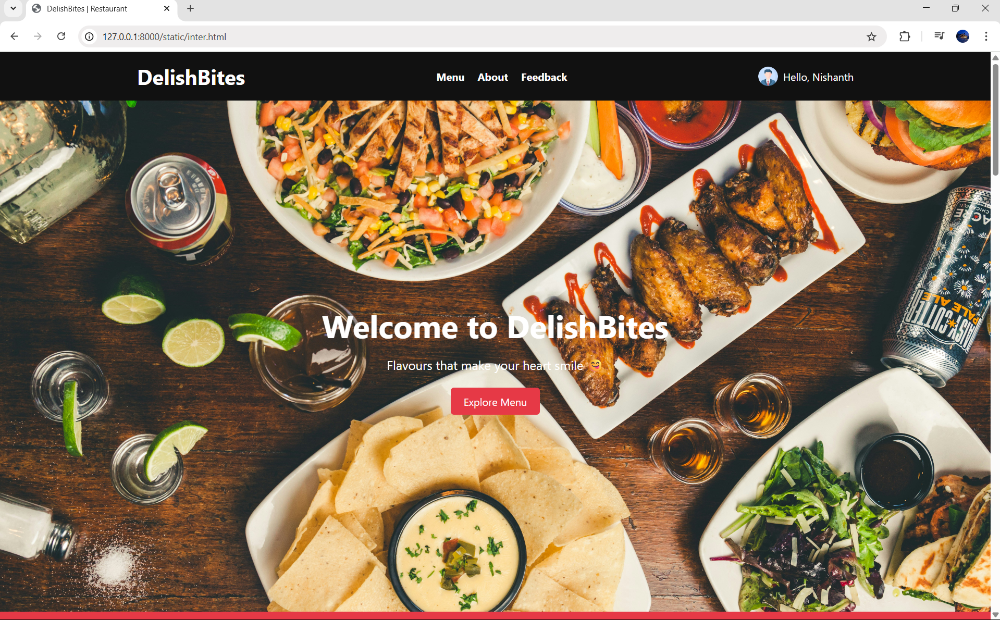
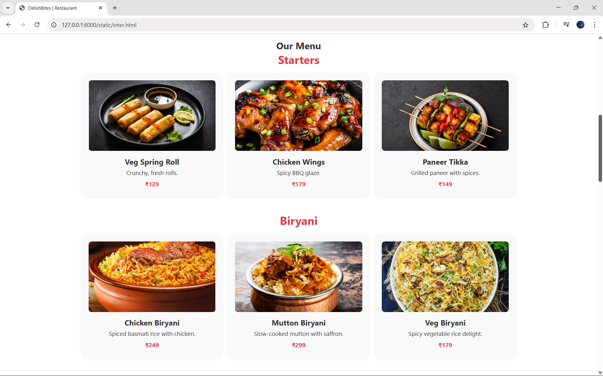
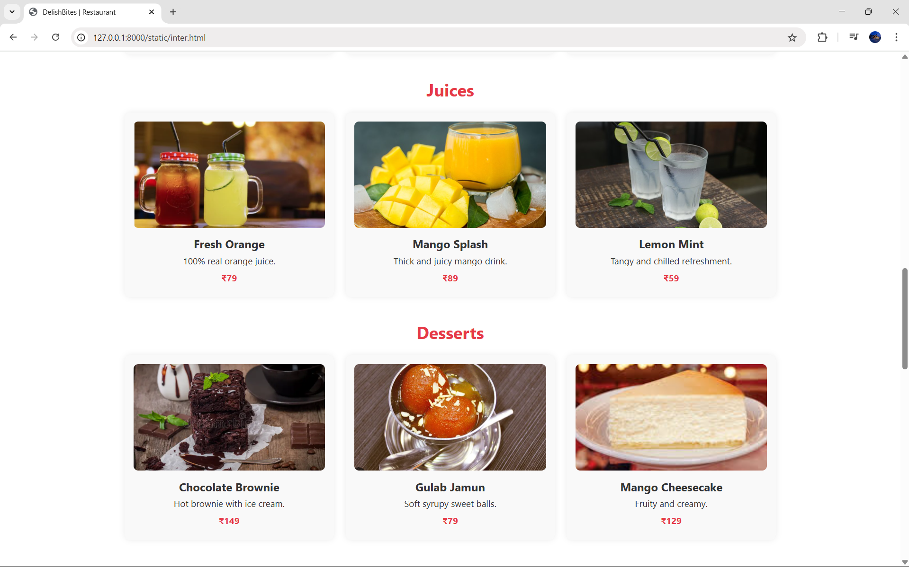
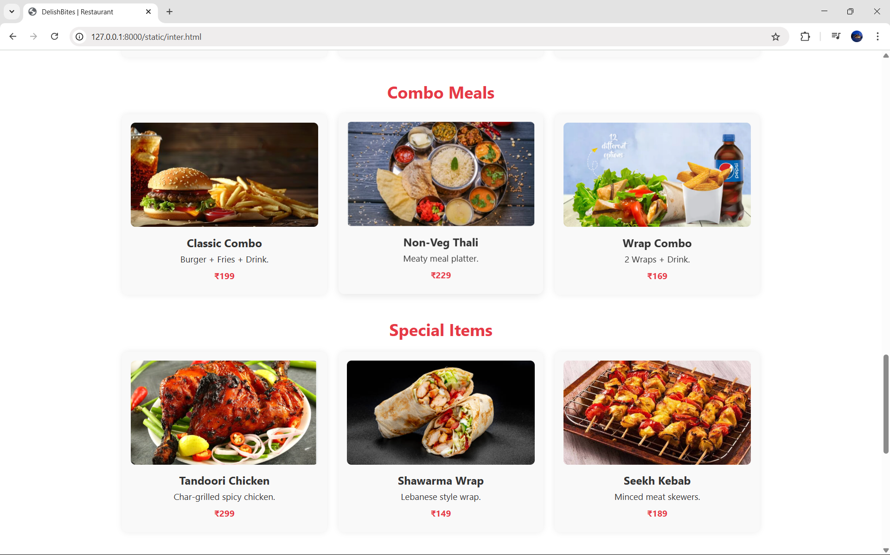
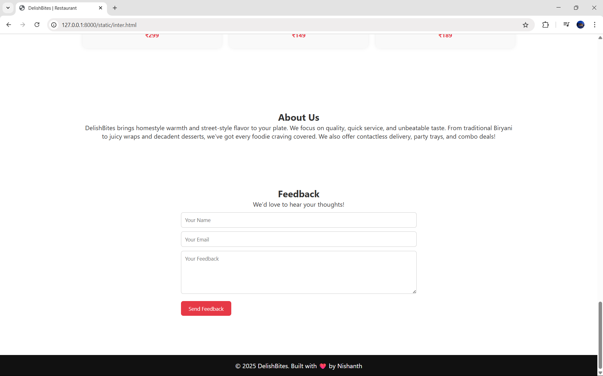

# Ex.07 Restaurant Website
## Date:24.05.2025

## AIM:
To develop a static Restaurant website to display the food items and services provided by them.

## DESIGN STEPS:

### Step 1:
Requirement collection.

### Step 2:
Creating the layout using HTML and CSS.

### Step 3:
Updating the sample content.

### Step 4:
Choose the appropriate style and color scheme.

### Step 5:
Validate the layout in various browsers.

### Step 6:
Validate the HTML code.

### Step 7:
Publish the website in the given URL.

## PROGRAM:
```
inter.html

<!DOCTYPE html>
<html lang="en">
<head>
  <meta charset="UTF-8" />
  <meta name="viewport" content="width=device-width, initial-scale=1.0"/>
  <title>DelishBites | Restaurant</title>
  <style>
    :root {
      --main-color: #e63946;
      --dark-bg: #111;
      --light-bg: #f9f9f9;
      --text-color: #333;
    }

    * {
      margin: 0;
      padding: 0;
      box-sizing: border-box;
      font-family: 'Segoe UI', sans-serif;
    }

    body {
      color: var(--text-color);
      background-color: #fff;
    }

    header {
      background: var(--dark-bg);
      color: #fff;
      padding: 1rem 0;
    }

    .container {
      width: 90%;
      max-width: 1100px;
      margin: auto;
    }

    .header-flex {
      display: flex;
      justify-content: space-between;
      align-items: center;
      flex-wrap: wrap;
    }

    nav ul {
      display: flex;
      list-style: none;
      gap: 20px;
    }

    nav ul li a {
      color: #fff;
      text-decoration: none;
      font-weight: bold;
    }

    .username {
      display: flex;
      align-items: center;
      gap: 8px;
    }

    .username img {
      width: 30px;
      height: 30px;
      border-radius: 50%;
    }

    .hero {
      background: url('https://images.unsplash.com/photo-1600891964599-f61ba0e24092') center/cover no-repeat;
      height: 90vh;
      color: #fff;
      display: flex;
      align-items: center;
      justify-content: center;
      text-align: center;
    }

    .hero .container {
      max-width: 600px;
    }

    .hero h2 {
      font-size: 3rem;
      margin-bottom: 1rem;
    }

    .hero p {
      font-size: 1.2rem;
      margin-bottom: 2rem;
    }

    .btn {
      padding: 10px 20px;
      background: var(--main-color);
      color: #fff;
      text-decoration: none;
      border-radius: 5px;
      transition: background 0.3s;
    }

    .btn:hover {
      background: #c92e3e;
    }

    .delivery-banner {
      background: var(--main-color);
      color: #fff;
      padding: 15px 0;
      text-align: center;
      font-weight: bold;
    }

    section {
      padding: 60px 0;
      text-align: center;
    }

    .menu-category {
      margin-bottom: 40px;
    }

    .menu-category h3 {
      font-size: 1.8rem;
      margin-bottom: 20px;
      color: var(--main-color);
    }

    .menu-items {
      display: grid;
      grid-template-columns: repeat(auto-fit, minmax(280px, 1fr));
      gap: 20px;
    }

    .item {
      background: var(--light-bg);
      padding: 15px;
      border-radius: 10px;
      box-shadow: 0 0 10px rgba(0,0,0,0.08);
      transition: transform 0.3s, box-shadow 0.3s;
    }

    .item:hover {
      transform: translateY(-5px);
      box-shadow: 0 10px 20px rgba(0,0,0,0.15);
    }

    .item img {
      width: 100%;
      height: 180px;
      object-fit: cover;
      border-radius: 8px;
      margin-bottom: 10px;
    }

    .item h4 {
      margin-bottom: 5px;
      font-size: 1.2rem;
    }

    .item p {
      font-size: 0.95rem;
      margin-bottom: 8px;
    }

    .price {
      font-weight: bold;
      color: var(--main-color);
    }

    form {
      max-width: 600px;
      margin: auto;
      text-align: left;
    }

    form input, form textarea {
      width: 100%;
      padding: 10px;
      margin-top: 10px;
      border: 1px solid #ccc;
      border-radius: 6px;
    }

    form button {
      margin-top: 15px;
      background: var(--main-color);
      color: #fff;
      border: none;
      padding: 10px 20px;
      border-radius: 6px;
      cursor: pointer;
    }

    form button:hover {
      background: #c92e3e;
    }

    footer {
      background: var(--dark-bg);
      color: #fff;
      text-align: center;
      padding: 1rem 0;
      margin-top: 40px;
    }

    @media(max-width: 768px) {
      .hero h2 {
        font-size: 2rem;
      }

      .hero p {
        font-size: 1rem;
      }

      nav ul {
        flex-direction: column;
        align-items: flex-start;
        gap: 10px;
      }

      .header-flex {
        flex-direction: column;
        align-items: flex-start;
        gap: 10px;
      }
    }
  </style>
</head>
<body>
  <header>
    <div class="container header-flex">
      <h1>DelishBites</h1>
      <nav>
        <ul>
          <li><a href="#menu">Menu</a></li>
          <li><a href="#about">About</a></li>
          <li><a href="#feedback">Feedback</a></li>
        </ul>
      </nav>
      <div class="username">
        
        <span>Hello, Nishanth</span>
      </div>
    </div>
  </header>

  <section class="hero">
    <div class="container">
      <h2>Welcome to DelishBites</h2>
      <p>Flavours that make your heart smile 😋</p>
      <a href="#menu" class="btn">Explore Menu</a>
    </div>
  </section>

  <div class="delivery-banner">
    🚚 Free Delivery within 5 KM! Order Now & Enjoy Hot Meals at Home!
  </div>

  <section id="menu">
    <div class="container">
      <h2>Our Menu</h2>

      <!-- Starters -->
      <div class="menu-category">
        <h3>Starters</h3>
        <div class="menu-items">
          <div class="item"><h4>Veg Spring Roll</h4><p>Crunchy, fresh rolls.</p><p class="price">₹129</p></div>
          <div class="item"><h4>Chicken Wings</h4><p>Spicy BBQ glaze.</p><p class="price">₹179</p></div>
          <div class="item"><h4>Paneer Tikka</h4><p>Grilled paneer with spices.</p><p class="price">₹149</p></div>
        </div>
      </div>

      <!-- Biryani -->
      <div class="menu-category">
        <h3>Biryani</h3>
        <div class="menu-items">
          <div class="item"><h4>Chicken Biryani</h4><p>Spiced basmati rice with chicken.</p><p class="price">₹249</p></div>
          <div class="item"><h4>Mutton Biryani</h4><p>Slow-cooked mutton with saffron.</p><p class="price">₹299</p></div>
          <div class="item"><h4>Veg Biryani</h4><p>Spicy vegetable rice delight.</p><p class="price">₹179</p></div>
        </div>
      </div>

      <!-- Juices -->
      <div class="menu-category">
        <h3>Juices</h3>
        <div class="menu-items">
          <div class="item"><h4>Fresh Orange</h4><p>100% real orange juice.</p><p class="price">₹79</p></div>
          <div class="item"><h4>Mango Splash</h4><p>Thick and juicy mango drink.</p><p class="price">₹89</p></div>
          <div class="item"><h4>Lemon Mint</h4><p>Tangy and chilled refreshment.</p><p class="price">₹59</p></div>
        </div>
      </div>

      <!-- Desserts -->
      <div class="menu-category">
        <h3>Desserts</h3>
        <div class="menu-items">
          <div class="item"><h4>Chocolate Brownie</h4><p>Hot brownie with ice cream.</p><p class="price">₹149</p></div>
          <div class="item"><h4>Gulab Jamun</h4><p>Soft syrupy sweet balls.</p><p class="price">₹79</p></div>
          <div class="item"><h4>Mango Cheesecake</h4><p>Fruity and creamy.</p><p class="price">₹129</p></div>
        </div>
      </div>

      <!-- Combos -->
      <div class="menu-category">
        <h3>Combo Meals</h3>
        <div class="menu-items">
          <div class="item"><h4>Classic Combo</h4><p>Burger + Fries + Drink.</p><p class="price">₹199</p></div>
          <div class="item"><h4>Non-Veg Thali</h4><p>Meaty meal platter.</p><p class="price">₹229</p></div>
          <div class="item"><h4>Wrap Combo</h4><p>2 Wraps + Drink.</p><p class="price">₹169</p></div>
        </div>
      </div>

      <!-- Special -->
      <div class="menu-category">
        <h3>Special Items</h3>
        <div class="menu-items">
          <div class="item"><h4>Tandoori Chicken</h4><p>Char-grilled spicy chicken.</p><p class="price">₹299</p></div>
          <div class="item"><h4>Shawarma Wrap</h4><p>Lebanese style wrap.</p><p class="price">₹149</p></div>
          <div class="item"><h4>Seekh Kebab</h4><p>Minced meat skewers.</p><p class="price">₹189</p></div>
        </div>
      </div>
    </div>
  </section>

  <section id="about">
    <div class="container">
      <h2>About Us</h2>
      <p>DelishBites brings homestyle warmth and street-style flavor to your plate. We focus on quality, quick service, and unbeatable taste. From traditional Biryani to juicy wraps and decadent desserts, we’ve got every foodie craving covered. We also offer contactless delivery, party trays, and combo deals!</p>
    </div>
  </section>

  <section id="feedback">
    <div class="container">
      <h2>Feedback</h2>
      <p>We’d love to hear your thoughts!</p>
      <form>
        <input type="text" placeholder="Your Name" required>
        <input type="email" placeholder="Your Email" required>
        <textarea rows="5" placeholder="Your Feedback" required></textarea>
        <button type="submit">Send Feedback</button>
      </form>
    </div>
  </section>

  <footer>
    <div class="container">
      <p>&copy; 2025 DelishBites. Built with ❤️ by Nishanth</p>
    </div>
  </footer>
</body>
</html>

```

## OUTPUT:






## RESULT:
The program for designing software company website using HTML and CSS is completed successfully.
